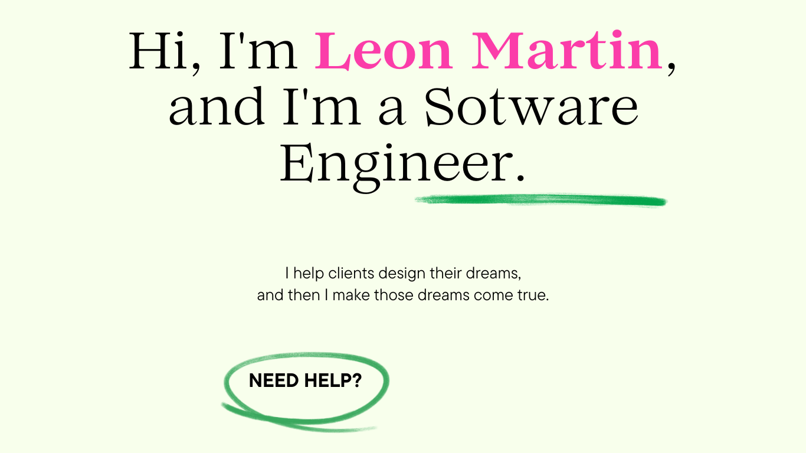

<h1 align="center">Hi 👋, I'm leon Martin</h1>
<h3 align="center">Hello, I'm Leon, a dedicated programmer in the world of cybersecurity.</h3>

I am captivated by the ever-evolving landscape of cybersecurity 🔒, where the constant battle between digital threats and protective measures shapes the digital realm. My intrigue in cybersecurity began as I marveled at the complex dance between hackers and defenders, prompting me to delve into the world of coding and security protocols.

The dynamic nature of cybersecurity fuels my passion for coding and problem-solving in the digital domain. The unpredictability of cyber threats motivates me to explore and master various coding languages and security frameworks, enabling me to build robust defenses against potential vulnerabilities. Embracing the latest security technologies 💻 and incorporating them into my coding endeavors exhilarates me, as I strive to construct resilient systems that stand strong against the ever-present challenges in the cyber landscape. 🚀

 
 <!--   -->
 
<!--   -->

  
  
  
  
  
 

 

  
  
  
  
  
  

  

- 👀 I’m currently working on full stack web development using HTML5, JS, Vue, Python, and Flask, Android application development using the Kivy framework, Python, and Java, and Desktop Application development using Python.
- 🌱 I’m currently learning machine learning and artificial intelligence.
- 💞️ I’m looking to collaborate on GitHub.
<!-- - 📫 How to reach me: [LinkedIn](https://www.linkedin.com/in/martin-muruthi-0b7945234/) and [website](https://leonteqsecurity.com/) -->
- 😄 Fun fact: I love learning new hacking techniques and concepts, and I usually spend my leisure time doing so.

 
<h3 align="left">Connect with me:</h3>

 

<h3 align="left">Languages and Tools:</h3>

- Backend

  

- Frontend

  

- Database

  

- Cloud Servers

  

- Tools

  

 

<h3 align="left">Trophy:</h3>

  

 

 

   

<h3 align="left">GitHub Stats:</h3>

 

  

<!-- <h3 align="left">Activity:</h3> -->

<!--  -->
  

 <em><b>I love connecting with different people</b> so if you want to say <b>hi, I'll be happy to meet you more!</b> :)</em>

 